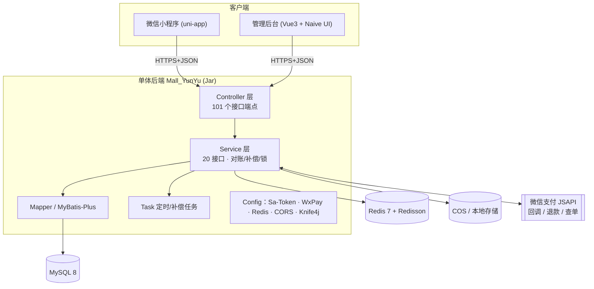

# 生鲜商城系统（fresh-mall）

> 一个**可直接商用、已对接真实微信支付**的 B2C 生鲜电商小程序。
> 单体后端 · 微信小程序 · 管理后台，前后端分离，**交易闭环完整、真钱可收款**。

<p align="center">
  <b>Java 21 · Spring Boot 3.3 · MyBatis-Plus · Sa-Token · Redis / Redisson · uni-app · Vue3 · Naive UI · 微信支付 V3</b>
</p>

---

## 在线演示（视频）

> 全栈开发 + 功能演示 + 项目分享的完整讲解视频：扫码或点击图片，在抖音观看。

[](https://v.douyin.com/4WZcNwBe4k/)

| 项 | 说明 |
|----|------|
| 演示视频 | [点击跳转抖音](https://v.douyin.com/4WZcNwBe4k/)　`https://v.douyin.com/4WZcNwBe4k/` |
| 主播 / 抖音号 | Universe未编码 · 29246647301 |
| 观看方式 | 保存上方图片到相册 → 抖音 App「扫一扫」识别；或复制 URL 在抖音打开 |

> 说明：该二维码为作者抖音主页分享码，视频由项目作者本人录制，可用于了解系统全貌与真实支付演示流程。

## 0. 项目一句话

面向 C 端消费者的**生鲜电商小程序**，覆盖「浏览 → 加购 → 下单 → **微信支付（真实到账）** → 发货 → 收货 → 售后退款」完整闭环，配一套功能齐全的商家管理后台。后端为**单体架构**，无网关、无 Nacos、不引入多余分布件复杂度；并发扣库存 / 支付幂等由 **Redis + Redisson** 在业务层解决。

---

## 1. 功能模块图（第一屏 · 先看清能力）

> 以下两图基于**真实代码**绘制（非概念图），请在支持 Mermaid 的平台上渲染（GitHub 原生支持）。

### 1.1 总体模块构成（三端四域）

```mermaid
flowchart LR
    subgraph MP["微信小程序（C端 · uni-app）"]
        A1["首页 / 分类 / 搜索"]
        A2["商品详情 · 规格选择"]
        A3["购物车"]
        A4["确认订单 · 支付"]
        A5["订单列表 / 详情 / 假配送图"]
        A6["售后申请 · 退款进度"]
        A7["我的 · 收藏 · 收货地址 · 登录"]
    end
    subgraph ADM["管理后台（商家 · soybean-admin）"]
        B1["运营看板（今日订单/销售额/待办）"]
        B2["订单管理 · 配送完成 · 确认送达 · Excel导出"]
        B3["商品管理 · 分类 · 多SKU规格 · 上下架"]
        B4["库存管理 · 手动调整 · 变动流水"]
        B5["售后管理 · 同意/拒绝退款"]
        B6["内容运营 · Banner · 公告 · 店铺配置 · 服务项"]
        B7["系统管理 · 管理员 · 用户 · 支付与存储配置"]
    end
    subgraph BE["单体后端（Mall_YunYu）"]
        C1["登录/用户/地址/收藏"]
        C2["商品/分类/推荐"]
        C3["购物车"]
        C4["订单（状态机·防超卖）"]
        C5["微信支付（回调·退款·对账）"]
        C6["售后/退款"]
        C7["库存（实时+流水）"]
        C8["店铺/内容/配置/看板/上传"]
        C9["定时任务：超时关单·支付对账·退款对账·推荐刷新"]
    end

    MP <--> BE
    ADM <--> BE
    BE --> C10["MySQL 8（23张表）"]
    BE --> C11["Redis 7（缓存+分布式锁）"]
    BE --> C12["腾讯云 COS / 本地存储"]
```



### 1.2 交易主链路（业务流程）


---

## 2. 技术架构（第二屏 · 讲清怎么选型）

### 2.1 系统架构图



### 2.2 为什么这么选（选型决策，写给读者看）

| 关注点 | 本项目选择 | 理由 |
|--------|-----------|------|
| **单体 or 微服务** | **单体单模块** | 单商户、单一业务域，微服务带来的服务发现/链路追踪是纯负担；`Redis` 已能解决唯一分布式痛点 |
| **网关 / Nacos** | **不做，没有** | 无多服务需路由与注册，引入只增加运维成本 |
| **后端框架** | Spring Boot 3.3（Java 21） | 生态成熟、容器友好；Java 21 LTS + 虚拟线程天然利于 IO 密集接口 |
| **ORM** | MyBatis-Plus 3.5.7 | 单表 CRUD 零 XML，复杂 SQL 手写用 `WHERE stock>=#{n}` 精确控制 |
| **缓存/并发** | Redis 7 + Redisson | 缓存加速 + 分布式锁（防重复支付、防并发扣库存、防并发对账） |
| **认证** | Sa-Token（双账号体系） | 内置 `StpUserUtil`(C端) / `StpAdminUtil`(后台) 两套会话，简单直观 |
| **支付** | WxJava 4.6（微信支付 V3） | SDK 内部完成签名/验签/解密/平台证书自动刷新，重点把精力放在业务兜底（补偿对账、幂等） |
| **接口文档** | Knife4j 4.5 (OpenAPI3) | dev 开启、prod 关闭，双环境隔离由配置驱动 |
| **存储** | 本地存储 + 腾讯云 COS（可切换） | `StorageService` 接口 + 策略，按 `sys_config` 一键切换 |
| **对象结构** | SPU / SKU 双轨 | 商品展示维度(SPU) 与 结算/库存维度(SKU) 分离，是电商标配 |

---

### 2.3 项目目录结构（三端一眼看懂）

```
生鲜商城系统/
├── README.md                          # 本文档
├── LICENSE                            # MIT 开源协议
├── .gitignore                         # git 忽略规则（密钥/证书/构建产物不入库）
├── douyin.jpg                         # 抖音演示视频二维码入口
├── 接口清单_Mall_YunYu.txt            # 后端全部接口清单（由 gen_api_doc.py 导出）
├── 图片资源区/  小程序第一套UI展示图/  # 界面展示素材
├── 12_运维部署/                       # 运维与演示数据
│   ├── 全量数据库fresh_mall.sql       # 建表 + 演示数据（初始化数据库用）
│   ├── 运维部署技术文档.md            # 部署上线操作手册
│   └── uploads/                       # 演示商品图（随仓库提交）
│
├── Mall_YunYu/                        # ① 后端服务（单体 · Java 21 · Spring Boot 3）
│   ├── pom.xml                        # Maven 工程
│   ├── gen_api_doc.py                 # 工具脚本：导出 SpringDoc 后端接口清单
│   └── src/main/
│       ├── java/com/mall_yunyu/
│       │   ├── MallYunYuApplication.java      # 启动入口
│       │   ├── controller/                   # REST 控制器（小程序端/后台/支付回调）
│       │   ├── service/ (+impl/)             # 业务逻辑（支付/订单/库存/退款/对账补偿）
│       │   ├── mapper/  entity/  dto/  vo/   # MyBatis-Plus 数据层/表实体/入参/出参
│       │   ├── common/                       # 统一返回 Result、异常、常量、工具
│       │   ├── config/                       # Sa-Token/微信支付/Knife4j/跨域等配置
│       │   └── task/                         # 定时任务（支付/退款对账补偿、推荐刷新）
│       └── resources/
│           ├── application.yml               # 开发配置（密钥全部 ${} 占位）
│           └── application-prod.yml          # 生产配置（路径/端口，密钥走环境变量）
│
├── soybean-admin/                    # ② 管理后台（Vue3 · TS · Naive UI）
│   └── src/
│       ├── main.ts / App.vue                 # 入口
│       ├── views/                            # 业务页面（商品/订单/库存/退款/系统/内容）
│       ├── components/  layouts/             # 通用组件与页面布局
│       ├── store/  router/                   # Pinia 状态 · vue-router
│       └── service/ + api/                   # Axios 请求封装 + 各模块接口
│
└── uni_free_mall/                    # ③ 小程序端（uni-app · Vue3 · uView Plus）
    └── src/
        ├── main.ts / App.vue / manifest.json / pages.json
        ├── pages/                            # 首页/分类/购物车/订单/我的 等页面
        ├── components/  stores/  utils/  api/  # 组件/状态/工具/接口封装
        └── static/                           # 静态资源
```

> 三端各持一份自己的 `.gitignore`，与根 `.gitignore` 共同拦截 `target/`、`node_modules/`、`dist/`、`certs/`、`*.pem`、`.env*` 等敏感与构建产物，确保密钥与证书不会误入版本库。

## 3. 快速开始（详细使用）

### 3.0 前置依赖

```
JDK 21 · MySQL 8.0+ · Redis 7.x · Node 18+/pnpm
```

### 3.1 后端（Mall_YunYu）

```bash
# 1) 初始化数据库：把 12_运维部署/全量数据库fresh_mall.sql 导入 MySQL（建表+演示数据）
#    mysql -uroot -p fresh_mall < "12_运维部署/全量数据库fresh_mall.sql"
# 2) 配置环境变量
export SPRING_PROFILES_ACTIVE=prod
export MYSQL_HOST=127.0.0.1
export REDIS_HOST=127.0.0.1
export MALL_CONFIG_SECRET=自定义种子密钥
export MALL_CERT_PATH=/data/mall/certs
export MALL_UPLOAD_PATH=/data/mall/uploads

# 3) 编译启动（需本机安装 Maven，或直接用 IDE 运行；仓库仅保留 .mvn 插件配置）
mvn clean package -DskipTests
java -jar target/Mall_YunYu-0.0.1-SNAPSHOT.jar

# dev 环境在线接口文档： http://localhost:8080/doc.html
```

### 3.2 管理后台（soybean-admin）

```bash
pnpm install
pnpm dev        # 本地开发
pnpm build      # 产物 dist/ 交给 Nginx
```

### 3.3 小程序（uni_free_mall）

```
HBuilderX 打开工程 → 配置小程序 AppID
→ 运行→小程序 → 上传 → 微信公众平台提交审核 → 发布
```

### 3.4 开启真实微信支付（一次到位）

1. 申请商户号（须个体/企业资质，[pay.weixin.qq.com](https://pay.weixin.qq.com)）。
2. 商户平台绑定小程序 `AppID` + 开通「JSAPI 支付」。
3. 后台「系统配置 → 微信支付」填入 6 项资料：AppID、AppSecret、商户号、APIv3 密钥、证书序列号、证书路径。
4. 证书 `apiclient_key.pem / apiclient_cert.pem` 放服务器**非公网**目录。
5. 配置 HTTPS 支付回调域名后，即可真实收款。

> 资料收集清单、证书安全约定见文末「部署上线」。

---

## 4. 功能实现详解（第三屏 · 核心逻辑讲透）

开源读者最想看的，是这几段"真功夫"。全部为源码既有实现。

### 4.1 防超卖：数据库原子扣减

扣库存不是"先查后减"，而是**一条 SQL 原子完成**，`stock >= 数量` 不成立即不生效：

```java
// InventoryServiceImpl.deduct()
UPDATE goods_inventory
   SET stock = stock - #{num}
 WHERE sku_id = #{skuId} AND stock >= #{num}
// 影响行数 == 0 → 抛 STOCK_NOT_ENOUGH，交给事务回滚
```

订单创建处于**同一个事务**，扣减失败整体回滚；取消订单 / 退款则通过 `rollback()` 加回库存并写 `inventory_log` 流水。

### 4.2 支付闭环：回调验签 → 幂等 → 对账补偿（三道防线）

**第一道 · 回调处理**：`PayCallbackServiceImpl` 无论验签成败、无论业务成败，**先落一条 `pay_callback_log` 审计**（原始报文截断 4000 字符、失败原因截断 255、脱敏字段），再验签解密 → 金额校验 → 状态机推进。

**第二道 · 幂等三重保障**：业务唯一键（`uk_out_trade_no` / `uk_order_no`）+ 状态位（`paid`/`status`）+ **Redisson 锁** `pay:lock:{orderNo}`，保证同一个回调重复收到、结果是同一个。

**第三道 · 主动对账补偿（关键兜底）**：回调可能丢失，靠两个定时任务兜底：

```text
PayCompensationTask     每 3 分钟  扫「待支付+创建>3分钟」订单 → queryOrderV3 → SUCCESS 则补单
RefundCompensationTask  每 5 分钟  扫「处理中+outRefundNo非空+创建>10分钟」退款单 → refundQueryV3
```

均带 Redisson 分布式锁，多实例不重复对账。

### 4.3 金额一致性（防少付/防误差）

- 全库 `DECIMAL(10,2)` + Java `BigDecimal`，杜绝浮点误差；
- 与微信交互统一 `payPrice * 100` 取整到分，`HALF_UP` 对齐：
  ```java
  order.getPayPrice().multiply(BigDecimal.valueOf(100)).setScale(0, RoundingMode.HALF_UP).intValue()
  ```
- 回调若 `回调金额 != 本地实付` 抛 `PAY_AMOUNT_MISMATCH`，绝不置已支付。

### 4.4 订单状态机（只正向、留痕）

```
待付款(0) ──支付成功──▶ 待发货(1) ──配送完成──▶ 待收货(2) ──确认送达──▶ 已完成(3)
    └──超时30分钟/用户取消──▶ 已取消(9)
```

所有流转走乐观锁 `updateStatus(id, fromStatus, toStatus)`，**影响行数=0 即判定并发冲突**，并强制写 `order_status_log`（谁操作、原状态、新状态）。后台不提供"取消订单 / 直接退款"按钮，从源头防资损。

### 4.5 配置热更新（改支付参数不用重启）

微信支付配置存 `sys_config`（APIv3 密钥 AES 密文入库）。后台保存后发布 `SysConfigChangedEvent`，`WxPayConfig.reload()` 重装 SDK 配置**即时生效**；`hasRealText()` 识别 `your-*` 占位，避免把 yml 兜底当真配置。启动时创建接口在 `ApplicationReadyEvent` 后再装载真实库配置，避免 DB 未就绪导致 Bean 初始化失败。

### 4.6 假配送 (业务特色)

无骑手、无真实物流节点：支付成功即在前端展示"备货中 → 配送中 → 已送达"假配送图。商家线下配送 + 电话确认后，后台点【配送完成】(1→2) /【确认送达】(2→3，可代用户确认)。所有状态与 `order.status` 严格同步。

---

## 5. 踩坑经验总结（重点 · 全是真实教训）

> 以下经验全部来自本项目实际开发/审查中被发现并修复的坑，按"现象 → 根因 → 解法"记录。写进 README 就是给后来者的避坑地图。

### 5.1 支付与订单

| # | 现象 | 根因 | 解法 |
|---|------|------|------|
| 1 | 已取消订单却收到微信支付成功回调，订单被置"已支付" | 回调未校验 `cancelStatus` | `handlePaySuccess` 更新失败后**重查订单**，若已取消则 `markPaidAndAutoRefund()` 自动原路退款 |
| 2 | 回调被反复投递，重复置已支付 / 重复退款 | 回调无幂等 | 唯一键 + 状态位 + Redisson 锁，三重保障 |
| 3 | 订单/退款永久卡住（回调丢失） | 只依赖被动回调 | 每 3/5 分钟**主动向微信查单**对账兜底 |
| 4 | 退款金额超订单实付、退款被无限退 | 缺少金额校验 | `agreeRefund` 强制 `0 < 退款额 <= 订单实付` |
| 5 | 回调金额对不上，少付照样发货 | 金额列表比较缺失 | 回调/查单后比对金额，不一致抛异常**绝不发货** |
| 6 | `pay_callback_log` 建了没人写，线上事故无排查线索 | 逻辑遗漏 | 无论成败**先落审计**，再验签处理 |
| 7 | 订单号/退款号高并发碰撞 | 随机段过短 | 前缀 + 14位时间戳 + 4位自增 + 3位随机（≤25字符），库唯一索引兜底 |
| 8 | 退款"退款中"状态缺失，与微信异步对不上 | 直接置终态 | 引入「退款中」中间态，由回调/查单驱动终态 |

### 5.2 库存

| # | 现象 | 根因 | 解法 |
|---|------|------|------|
| 9 | 并发超卖 | 先查库存后扣减（非原子） | 原子 SQL `WHERE stock >= #{num}`，影响行数=0 抛异常 |
| 10 | 取消/退款后库存不恢复 | 未回滚 | 按 `order_item` 逐一 `rollback()` 加回 |
| 11 | 库存被手工改过无法追踪 | 无流水 | 每次扣减/回滚/调整强制写 `inventory_log`（前后数量、操作人、类型） |
| 12 | 打烊了还能下单 | 入口未拦截 | `createOrder` 开头校验 `isShopClosed()`，打烊直接抛错 |
| 13 | 超额回滚产生负库存 | `rollback` 无下限保护 | 后续建议加 `stock >= 0` 与版本号（当前为已知待改进点） |

### 5.3 登录与合规

| # | 现象 | 根因 | 解法 |
|---|------|------|------|
| 14 | token 过期会打断用户操作（如结算中途跳登录） | 全局硬跳 401 | **静默重登**：复用 `wx.login` code 换新 token，`reloginLock` 并发只跑一次 |
| 15 | 个人主体开不了 `getPhoneNumber` | 主体能力限制 | 微信授权失败 → **优雅降级为手动填写**手机号 |
| 16 | 手机号被多个账号占用 | 换绑无校验 | `checkPhoneUnique` 绑定/换绑前校验唯一 |
| 17 | 隐私合规不合规被拒 | 未处理隐私协议 | 显式勾选 + `wx.openPrivacyContract` 官方指引页 + `onNeedPrivacyAuthorization` 拦截 |

### 5.4 工程与配置

| # | 现象 | 根因 | 解法 |
|---|------|------|------|
| 18 | 后端一片 blank，前端无接口可调 | Controller 从未创建（历史上缺） | 补全 20 个 Controller / 101 端点，全量对齐 Sa-Token、`@Valid`、统一 `Result<T>` |
| 19 | 管理员登录被爆破 | 无失败次数限制 | Redis 失败计数 + 锁定限流 |
| 20 | 登录日志随主事务一起回滚丢日志 | 日志与业务同一事务 | 抽独立事务（`REQUIRES_NEW`）写登录日志 |
| 21 | 批量备注造成 N+1 | 循环单条 update | 改 `updateBatchById` 批量更新 |
| 22 | 配置字符串解析空值抛异常 | 无兜底 | 默认值兜底 + try/catch |
| 23 | 支付/COS 密钥明文入库泄露风险 | 未加密 | AES 密文入库（`CryptoUtils`），证书只存路径、严禁静态映射 |
| 24 | yml 里写死兜底占位被当成真实配置 | 哨兵值判定缺失 | `hasRealText()` 排除 `your-*` 前缀占位 |

### 5.5 已知待改进（如实公示，不藏）

- 库存回滚无 `stock>=0` 保护、扣减无 version 乐观锁 → 极端并发下可能负库存。
- 订单列表存在 N+1 查询（先查单再逐批取明细）。
- 订单号自增段为进程内 `AtomicInteger`，**多实例部署需换 Snowflake/中心化序列**（单体单机无碍）。
- 支付/退款补偿任务是"定时全量扫描 + 分布式锁"，无订单维度指数退避。
- 未内置业务级单元测试与 Dockerfile；验收以"真实支付 + 真实退款走通"为准。
- `wxjava 4.6.0` 尚不支持「微信支付公钥」模式字段 setter，后续升级 4.7+ 可接。

---

## 6. 后端资产清单

### 6.1 接口规模（101 个端点）
- 小程序端 / 公开接口：**39**（登录、用户、首页、商品、分类、购物车、订单、支付、售后、地址、收藏、上传）
- 管理后台接口：**60**（管理员、订单、商品、分类、库存、售后、Banner、公告、店铺、服务项、系统配置、上传、用户、看板）
- 微信回调：**2**（支付、退款）

### 6.2 数据库（约 23 张表）

| 域 | 表 |
|----|----|
| 系统 | `admin` `admin_login_log` |
| 用户 | `user` `user_address` `user_favorite` |
| 商品 | `goods_category` `goods_spu` `goods_sku` `goods_recommend` |
| 库存 | `goods_inventory` `inventory_log` |
| 交易 | `cart` `order_info` `order_item` `order_status_log` |
| 支付 | `pay_order` `pay_callback_log` `refund_order` `refund_order_item` |
| 内容 | `banner` `notice` |
| 配置 | `shop_config` `shop_service_item` `sys_config` |

### 6.3 核心技术点速查
- 定时/补偿任务 4 个：超时关单、支付对账、退款对账、推荐刷新（均带 Redisson 锁/幂等）。
- 鉴权双轨：`StpUserUtil`（C端）`StpAdminUtil`（后台）；回调 `/api/publicly/**` 匿名放行。
- Knife4j 仅 dev 开启；CORS 白名单；MyBatis-Plus 逻辑删除 `deleted`。

---

## 7. 部署上线流程

### 7.1 一次性准备
营业执照（个体/企业）→ 认证小程序（主体一致或关联主体）→ [申请商户号](https://pay.weixin.qq.com)（1–5 工作日）→ 备案 HTTPS 域名。

### 7.2 收集 6 项支付资料

| 资料 | 后端配置项 |
|------|-----------|
| 小程序 AppID | `wx.miniapp.appid` / `wx.pay.appid` |
| 小程序 AppSecret | `wx.miniapp.secret` |
| 商户号 mch_id | `wx.pay.mch-id` |
| APIv3 密钥(32位) | `wx.pay.api-v3-key` |
| 商户证书序列号 | `wx.pay.cert-serial-no` |
| `apiclient_cert.pem` + `apiclient_key.pem` | 证书路径（**严禁入库/入仓库**） |

### 7.3 上线自检清单
- [ ] 商户号已绑定小程序 AppID、已开通 JSAPI 支付
- [ ] 回调地址为 HTTPS 且网络可达
- [ ] 数据库已用 `fresh_mall建表SQL.sql` 初始化
- [ ] 证书路径、`wx.pay.*` 与环境变量（`SPRING_PROFILES_ACTIVE=prod`）配置正确
- [ ] 生产 `knife4j.enable=false`、无明文密钥、证书不在可公网访问目录

---

## 8. 开源协作约定

- **严禁提交**：`apiclient_key.pem`、商户证书、`application-prod.yml` 真实密钥、COS SecretKey。
- **接口清单**：根目录 `接口清单_Mall_YunYu.txt`（`gen_api_doc.py` 生成）。
- **开发过程文档**：`开发文档/` 下含需求、架构、数据库、支付闭环、代码审查等全套，与本仓库一同开源。

---

## 联系作者（微信同号）

对本项目有**二开、定制、部署、合作**需求，欢迎随时联系：

- 📞 微信 / 电话（微信同号）：**19870569575**
- 📧 邮箱：**tearhacker@outlook.com**

> 也可先通过上方抖音演示视频了解系统全貌。

---

## 9. FAQ

- **有网关 / Nacos / 微服务吗？** 都没有，单体单模块，部署一个 Jar。
- **后台用的什么 UI 库？** **Naive UI**（早期开发文档曾写 Element Plus，请以仓库代码为准）。
- **能对接支付宝吗？** 后端已有支付抽象，当前正式对接**微信支付**。
- **打烊了顾客还能下单吗？** 不能，下单入口有营业状态硬校验，前端也全链路禁用。
- **退款是一次性全额吗？** 是，一单一退款单、仅退款不回库存，不搞部分退款。